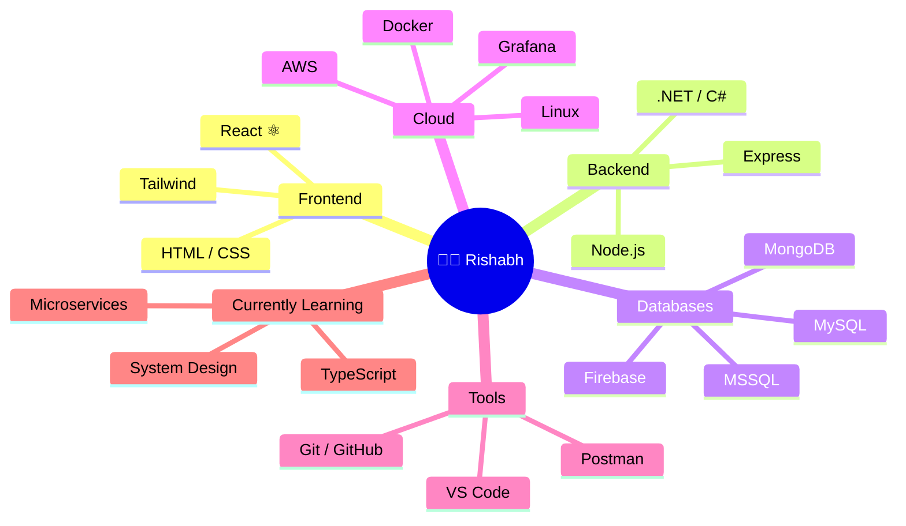

<!-- ╔══════════════════════════════════════════════════════════════╗ -->
<!-- ║   ✦  RISHABH DORA  •  GITHUB PROFILE README  ✦              ║ -->
<!-- ╚══════════════════════════════════════════════════════════════╝ -->

<!-- ═══════════════ HERO BANNER ═══════════════ -->
<div align="center">
  
  

</div>

<!-- ═══════════════ ANIMATED HAND WAVE + TITLE ═══════════════ -->
<div align="center">
  
  <h1>
    Hey there, I'm Rishabh
    
    
  </h1>
  
</div>

<!-- ═══════════════ TYPING ANIMATION ═══════════════ -->
<div align="center">
  
  <a href="https://github.com/01-rishabh">
    
  </a>
  
</div>

<br/>

<!-- ═══════════════ STATS PILLS ═══════════════ -->
<div align="center">
  
  
  
  
  
  
</div>

<!-- ═══════════════ ANIMATED RAINBOW DIVIDER ═══════════════ -->


<!-- ═══════════════ ABOUT ME ═══════════════ -->
##  &nbsp;About Me

<table>
<tr>
<td width="60%" valign="top">

```typescript
const rishabh: Developer = {
  pronouns:    "he/him",
  location:    "India 🇮🇳  ·  Remote 🌍",
  role:        "Software Developer",
  
  code:        ["JavaScript", "TypeScript", "C#", "C++"],
  
  stack: {
    frontend:  ["React", "HTML5", "CSS3", "Tailwind"],
    backend:   ["Node.js", "Express", ".NET"],
    database:  ["MongoDB", "MySQL", "MSSQL", "Firebase"],
    devops:    ["AWS", "Docker", "Linux", "Grafana"],
    tools:     ["Git", "Postman", "VS Code"]
  },
  
  currentFocus: "Scalable full-stack apps + cloud-native systems",
  learning:     ["System Design", "Microservices", "TypeScript"],
  
  funFact:  "I debug with console.log and I'm not ashamed 😎",
  motto:    "Code. Coffee. Commit. Repeat."
};
```

</td>
<td width="40%" valign="top" align="center">

  
  
  <br/>
  <br/>
  
  <a href="mailto:rishabhd.1121@gmail.com">
    
  </a>

</td>
</tr>
</table>

<!-- ═══════════════ DIVIDER ═══════════════ -->


<!-- ═══════════════ WHAT I'M UP TO ═══════════════ -->
##  &nbsp;What I'm Up To

<table>
<tr>
<td width="50%">

#### 🔭 &nbsp;Currently Building
- **Full-stack web apps** with the MERN stack
- **REST APIs** that don't break under pressure
- **Cloud-native side projects** on AWS

</td>
<td width="50%">

#### 🌱 &nbsp;Currently Learning
- **System Design** — scaling beyond hello-world
- **Microservices** with Docker + Kubernetes
- **TypeScript** advanced patterns & generics

</td>
</tr>
<tr>
<td width="50%">

#### 👯 &nbsp;Open to Collaborate on
- **Open-source projects** in JS / TS land
- **MERN stack** side hustles
- **Hackathons** & weekend builds

</td>
<td width="50%">

#### 💬 &nbsp;Ask Me About
- JavaScript, React, Node, Express
- MongoDB / MySQL schema design
- Deploying to AWS without crying

</td>
</tr>
</table>

<!-- ═══════════════ DIVIDER ═══════════════ -->


<!-- ═══════════════ TECH STACK ═══════════════ -->
##  &nbsp;Tech Stack

<div align="center">

#### &nbsp;✨ At a Glance
  
  <a href="https://skillicons.dev">
    
  </a>

</div>

<br/>

<details>
<summary><b>📦 &nbsp;Detailed Breakdown (click to expand)</b></summary>

<br/>

<div align="center">

#### &nbsp;Languages
<p>
  
  
  
  
  
  
</p>

#### &nbsp;Frontend
<p>
  
  
  
</p>

#### &nbsp;Backend
<p>
  
  
  
  
</p>

#### &nbsp;Databases
<p>
  
  
  
  
</p>

#### &nbsp;Cloud & DevOps
<p>
  
  
  
  
</p>

#### &nbsp;Tools
<p>
  
  
  
  
</p>

</div>
</details>

<br/>

<!-- ═══════════════ MERMAID MIND-MAP ═══════════════ -->
<details>
<summary><b>🧠 &nbsp;See My Skill Galaxy as a Mind Map</b></summary>



</details>

<br/>

<!-- ═══════════════ DIVIDER ═══════════════ -->


<!-- ═══════════════ GITHUB STATS ═══════════════ -->
##  &nbsp;GitHub Analytics

<div align="center">

  <a href="https://github.com/01-rishabh">
    
  </a>
  <a href="https://github.com/01-rishabh">
    
  </a>

</div>

<div align="center">

  <a href="https://github.com/01-rishabh">
    
  </a>
  
</div>

<br/>

<!-- ═══════════════ 3D CONTRIBUTION GRAPH ═══════════════ -->
###  &nbsp;3D Contribution Globe

<div align="center">
  
  
  
</div>

<br/>

<!-- ═══════════════ ACTIVITY GRAPH ═══════════════ -->
###  &nbsp;Contribution Activity

<div align="center">
  
  
  
</div>

<br/>

<!-- ═══════════════ TROPHIES ═══════════════ -->
###  &nbsp;Trophy Cabinet

<div align="center">
  
  <a href="https://github.com/01-rishabh">
    
  </a>
  
</div>

<br/>

<!-- ═══════════════ DIVIDER ═══════════════ -->


<!-- ═══════════════ FEATURED PROJECTS ═══════════════ -->
##  &nbsp;Featured Projects

<div align="center">

  <a href="https://github.com/01-rishabh/covid-tracker-app">
    
  </a>
  <a href="https://github.com/01-rishabh/amazon-clone">
    
  </a>

  <a href="https://github.com/01-rishabh/keeps-clone">
    
  </a>
  <a href="https://github.com/01-rishabh/DoraEcomBackend">
    
  </a>

  <a href="https://github.com/01-rishabh/newsMonkey">
    
  </a>
  <a href="https://github.com/01-rishabh/secrets.github.io">
    
  </a>

</div>

<br/>

<!-- ═══════════════ DIVIDER ═══════════════ -->


<!-- ═══════════════ SNAKE EATING CONTRIBUTIONS ═══════════════ -->
##  &nbsp;Watch My Contributions Get Eaten

<div align="center">
  
  <picture>
    <source media="(prefers-color-scheme: dark)" srcset="https://raw.githubusercontent.com/01-rishabh/01-rishabh/output/github-contribution-grid-snake-dark.svg"/>
    <source media="(prefers-color-scheme: light)" srcset="https://raw.githubusercontent.com/01-rishabh/01-rishabh/output/github-contribution-grid-snake.svg"/>
    
  </picture>
  
</div>

<br/>

<!-- ═══════════════ DIVIDER ═══════════════ -->


<!-- ═══════════════ SPOTIFY ═══════════════ -->
##  &nbsp;Currently Vibing To

<div align="center">
  
  <a href="https://open.spotify.com/user/YOUR_SPOTIFY_USER_ID">
    
  </a>
  
  <br/>
  <sub>🎧 &nbsp;<i>Code goes better with a soundtrack</i></sub>

</div>

<br/>

<!-- ═══════════════ DIVIDER ═══════════════ -->


<!-- ═══════════════ DEV QUOTE & JOKE ═══════════════ -->
##  &nbsp;Daily Dev Wisdom

<table>
<tr>
<td width="50%" align="center">

#### 💭 Quote of the moment

<a href="https://github.com/piyushsuthar/github-readme-quotes">
  
</a>

</td>
<td width="50%" align="center">

#### 😂 Joke that compiles

<a href="https://readme-jokes.vercel.app">
  
</a>

</td>
</tr>
</table>

<br/>

<!-- ═══════════════ HOLOPIN BADGES ═══════════════ -->
##  &nbsp;Holopin Badge Wall

<div align="center">
  
  <a href="https://holopin.io/@01-rishabh">
    
  </a>
  
  <br/>
  <sub><i>Earn yours by contributing to <a href="https://hacktoberfest.com">Hacktoberfest</a> and other open-source events</i></sub>

</div>

<br/>

<!-- ═══════════════ DIVIDER ═══════════════ -->


<!-- ═══════════════ CONNECT ═══════════════ -->
##  &nbsp;Let's Connect

<div align="center">
  
  <p><i>Got an idea? Want to collab? Just want to say hi? My DMs are always open.</i></p>

  <a href="https://www.linkedin.com/in/rishabh-dora-130854176/">
    
  </a>
  &nbsp;
  <a href="mailto:rishabhd.1121@gmail.com">
    
  </a>
  &nbsp;
  <a href="https://github.com/01-rishabh">
    
  </a>
  
</div>

<br/>

<!-- ═══════════════ EASTER EGG ═══════════════ -->
<details>
<summary align="center"><b>🥚 &nbsp;Found a secret? Click here</b></summary>

<br/>

<div align="center">

  
  
  <h3>You found the easter egg! 🎉</h3>
  <p>Mention <b>"avocado toast"</b> in your first message and I'll buy you a virtual coffee ☕</p>
  
</div>

</details>

<br/>

<!-- ═══════════════ FOOTER ═══════════════ -->
<div align="center">
  
  
  
  <sub>
    ⭐ <i>If you like what you see, drop a star on a repo — it really makes my day.</i><br/>
    Built with ❤️ &nbsp;and a lot of ☕ &nbsp;by <a href="https://github.com/01-rishabh"><b>01-rishabh</b></a>
  </sub>
  
</div>
